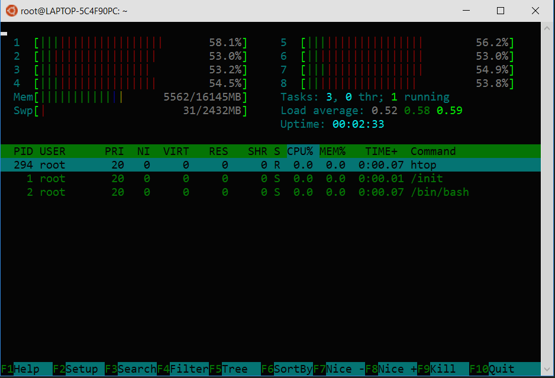

# Markdown
hej GRABBAR!

Alex Lindholm

jag är svenn

**bold text**

*italic text*

 Some green text 

 Some green text 

Roses are \textcolor{red}{red}, violets are \textcolor{blue}{blue}

[google link](https://www.google.com)

[Google](https://www.google.com/){:target="_blank"}

| Column 1 | Column 2 | Column 3 |
|----------|----------|----------|
|   Data 1 |   Data 2 |   Data 3 |

